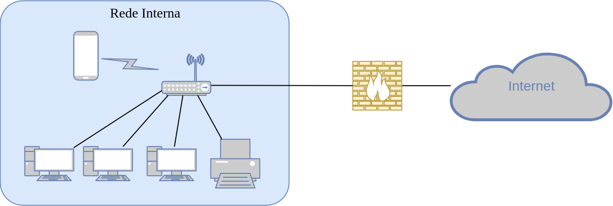

# core-iptables-20192

## Firewall

Firewall é um dispositivo baseado em hardware ou software que consiste basicamente em um bloqueador de tráfego de dados de entrada (*Incoming*) e saída (*Outgoing*) indesejados e liberar os acessos de interesse, entre as redes interconectadas.

São baseados inicialmente em dois princípios: no primeiro princípio, todo o tráfego é bloqueado, exceto o que está explicitamente liberado, já no segundo princípio todo o tráfego é permitido, exceto o que está explicitamente bloqueado.

